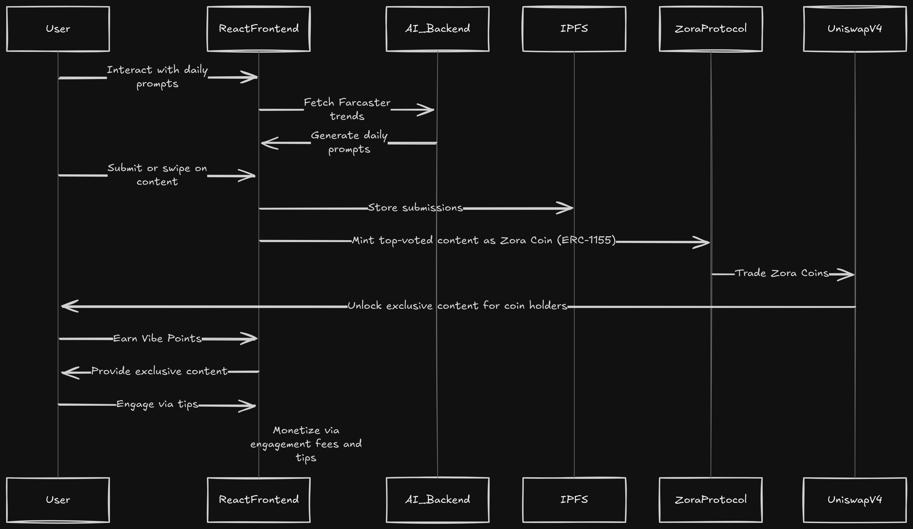

# 🌐 VibeCrafter

**VibeCrafter** is a Web3-powered social platform that gamifies content creation using real-time Farcaster trends, AI-generated challenges, and tokenized rewards. Top-voted content is minted as tradable **Zora Coins** and listed on **Uniswap V4**, creating a TikTok–Reddit–Zora hybrid that rewards creativity, virality, and engagement.

---

## 🚩 Problem Statement

Social media platforms today thrive on user-generated content, yet creators receive minimal reward, and trend discovery is scattered across platforms. There's no transparent or gamified system to reward users for creativity, community participation, and virality in a decentralized way.

---

## ✅ Solution: VibeCrafter

VibeCrafter introduces a fun, AI-driven, community-first platform where:
- 🧠 **AI** fetches and analyzes **Farcaster** trends to generate daily "Vibe Challenges."
- 🧑‍🎨 **Users** can submit memes, GIFs, links, or text-based content to compete.
- 💬 **Supporters** swipe to rate content and earn **Vibe Points (VP)** for engagement.
- 🏆 **Winning content** is minted as a **Zora Coin (ERC-1155 NFT)** and listed on **Uniswap V4**.
- 🔓 **Zora Coin holders** unlock exclusive content like AMAs or trend insights.

---

---

## 🔁 Core Workflow

1. **AI Trend Detection**  
   - NLP-based engine (inspired by Sonar API) analyzes Farcaster hashtags and post sentiment.  
   - Generates 3–5 trending challenges daily.

2. **Submission & Swipe Phase (24h)**  
   - Users submit content or swipe left/right to rate entries.  
   - Earn VP from likes, shares, and rating accuracy.

3. **Voting Phase (12h)**  
   - Top 5–10 submissions are shortlisted for public voting.  
   - Highest-voted content wins and gets minted.

4. **Tokenization & Trading**  
   - Winning content is minted as a **Zora Coin** via Zora protocol.  
   - Listed on **Uniswap V4** with price influenced by likes and shares.

5. **Access & Rewards**  
   - Zora Coin holders unlock exclusive content.  
   - Platform and creators earn from engagement fees, tips, and trading.

---

## 🧱 Tech Stack

| Component        | Tech Used                                                                 |
|------------------|---------------------------------------------------------------------------|
| Frontend         | React, Tailwind CSS                                                       |
| AI Backend       | NLP model (e.g., BERT), Python, AWS Lambda                                |
| Trend Source     | Farcaster (external API + Hashtag/Sentiment analysis)                     |
| Content Storage  | IPFS                                                                      |
| Tokenization     | Zora Protocol                                                             |
| Trading          | Uniswap V4 (using hooks for engagement-based liquidity adjustment)        |
| Token Gating     | Zora SDK                                                                  |
| Rewards Engine   | Custom VP logic + Leaderboard + Badges                                    |

---

## 💰 Monetization Model

- **Engagement Fees**:  
  - 0.01 ZORA per like  
  - 0.001 ZORA per swipe  

- **Coin Sales**:  
  - Platform and creators earn a share from Zora Coin sales  

- **Tips**:  
  - Optional tipping with ZORA  

- **Rewards**:  
  - Users earn VP, leaderboard coins, and profit from trading  

---

## 🎯 Success Metrics

- 1,000+ likes/swipes per challenge  
- 500+ upvotes per voting round  
- 20 ZORA per challenge in trading activity  
- 100+ Zora Coin trades per vibe  
- 500+ new followers and 1,000+ shares per challenge

---

## 📦 Example Flow

1. AI posts: “Make a meme about Dogecoin’s 2025 moonshot.”  
2. User “MemeFan” uploads a meme → gets 100 likes → earns 10 VP.  
3. Meme wins → gets minted as a Zora Coin → MemeFan earns royalties.  
4. Coin traded on Uniswap V4 → price increases with virality.  
5. Coin holders unlock an exclusive Dogecoin trend analysis video.

---

## 🛠️ Running the Project (Development)

### Frontend
```bash
cd frontend
npm install
npm run dev
```

## Backend (AI + API)
```bash
cd backend
pip install -r requirements.txt
python app.py
```

## 🚀 Future Plans

    Deeper Farcaster integration (social graph, sharing, DMs)

    Creator-customized challenges with fee splits

    DAO-based curation and community-owned vibe tokens

    Multi-chain support (e.g., Base, Optimism)

## 🧑‍💻 Built For
This project was built for a Zora + Farcaster ecosystem hackathon, focusing on the AI Agents, Creative UX, and Zora Protocol tracks. It showcases an end-to-end pipeline from trend detection to tokenized ownership and monetization.
